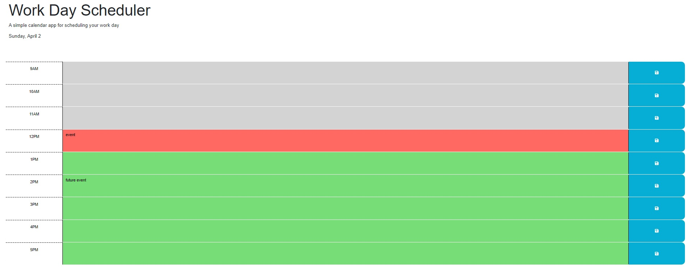

# Work Day Scheduler

# Overview

This project is a simple calendar application that allows users to save events for each hour of the day. The app runs in the browser and features dynamically updated HTML and CSS powered by jQuery. It uses the Day.js library to work with date and time.

# User Story

As an employee with a busy schedule, I want to add important events to a daily planner so that I can manage my time effectively.

# Acceptance Criteria

The following acceptance criteria were used to guide development:

When the user opens the planner, the current day is displayed at the top of the calendar.
When the user scrolls down, they are presented with timeblocks for standard business hours.
When the user views the timeblocks for the current day, each timeblock is color-coded to indicate whether it is in the past, present, or future.
When the user clicks into a timeblock, they can enter an event.
When the user clicks the save button for a timeblock, the text for that event is saved in local storage.
When the user refreshes the page, the saved events persist.

# Screenshot

Here's a screenshot of the application: 

# Deployment

The deployed application can be accessed at the following URL:

https://micci11.github.io/5ThirdPartyAPI/

# Repository

The GitHub repository for the project can be found at:

https://github.com/Micci11/5ThirdPartyAPI.git

# Contribution

Pull requests are welcome. For major changes, please open an issue first to discuss what you would like to change.

# License

MIT
